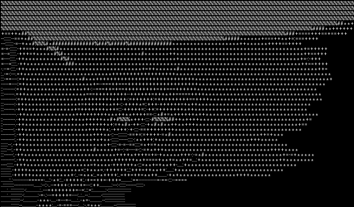
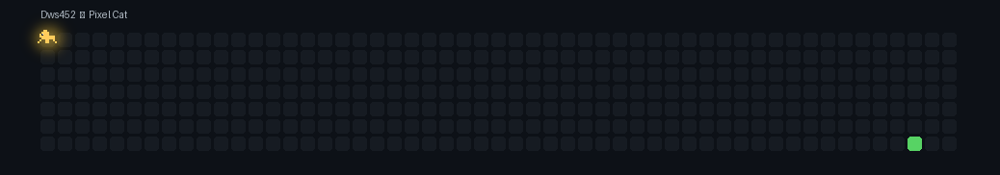

<h1 align="center"> </h1>
<h2 align="center"></h2>

  

<h2 align="center">🛠️ Языки программирования которые я изучаю🛠️</h2>

  
  
  
  

<h2 align="center"> где со мной связаться</h2>

  

<h2 align="center"> Моя активность github</h2>

  

